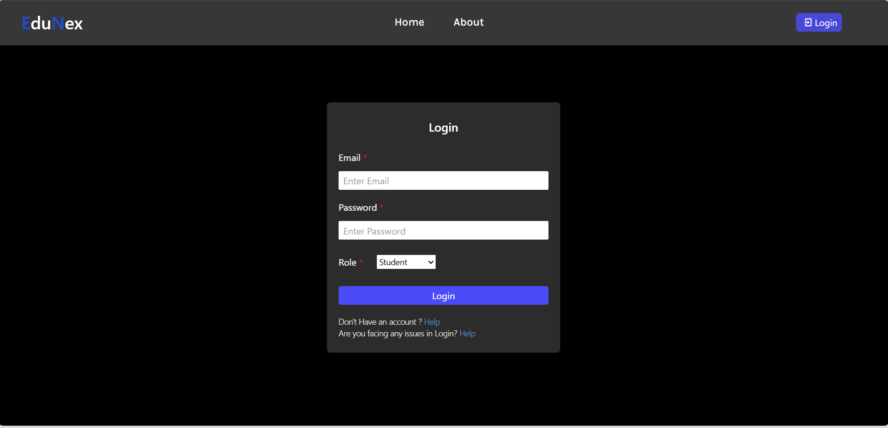
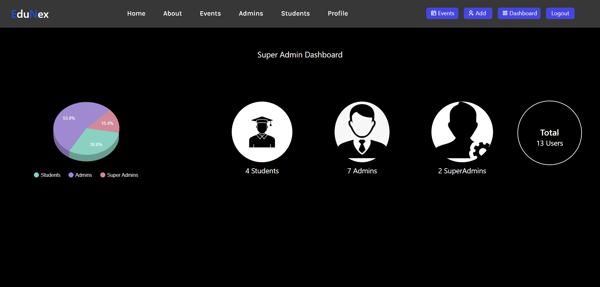
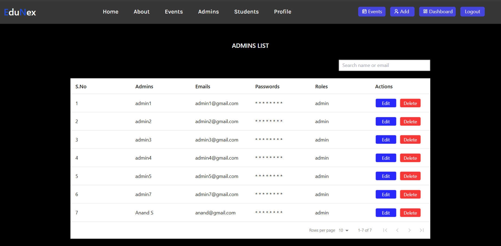
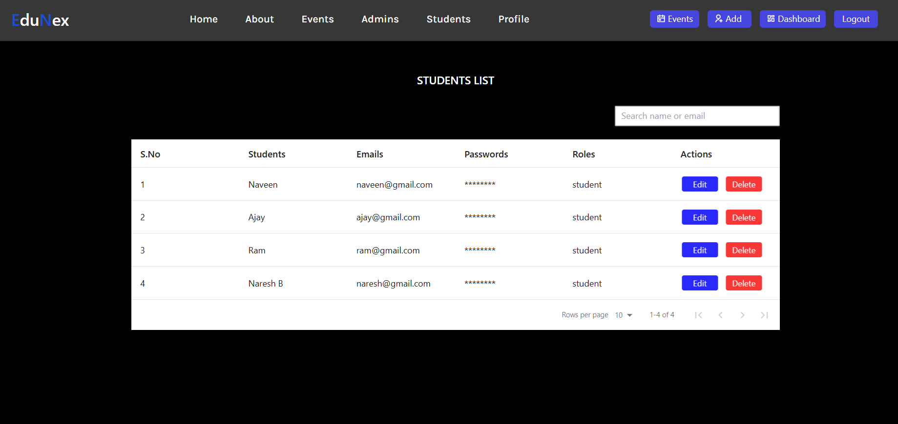
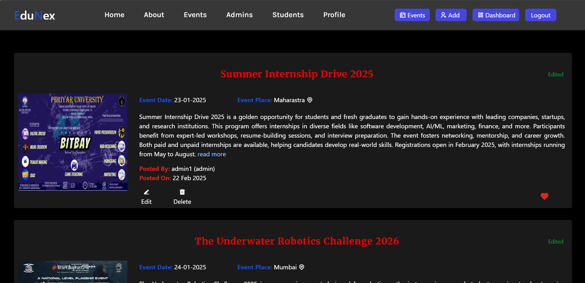
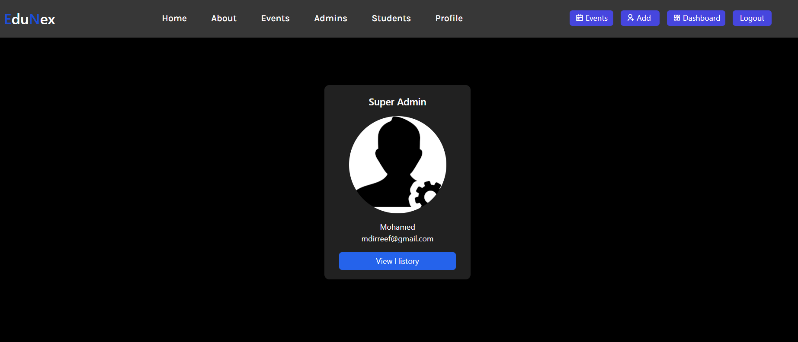
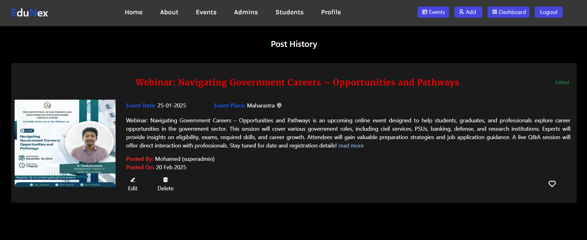

# Event Management Portal (University)

A **MERN stack** event management portal built for universities/colleges.

It supports **three roles**:
- **Principal/HOD (Super Admin)**
- **Staff (Admin)**
- **Students**

Super Admins and Staff can publish upcoming events/programs. Students can view full event details and receive **email notifications** when new events are posted.

## Features

### Role-based access

**Principal/HOD (Super Admin)**
- Add new Staff/Admins and Students
- Edit/update Staff/Admins and Students
- Delete Staff/Admins and Students
- Dismiss (remove) a Staff/Admin

**Staff (Admin)**
- Cannot add another Staff/Admin
- Cannot view other Staff/Admin details
- Can create event posts
- Can edit/delete their own posts
- Can view their own post history

**Students**
- Login and view event posts
- View event details (who is conducting, where/when, etc.)
- Receive email notification when a Staff/Admin or Super Admin posts a new event

### Event posts
- Create posts for future events/programs happening inside the college or elsewhere
- Image upload support for posts
- Edit/delete posts by the author (Staff/Admin or Super Admin)

## UI Screenshots

### Home Page


### Login Page


### Super Admin Dashboard


### Admins List


### Students List


### Create Post


### User Profile


### Post History



## Tech Stack / Packages

### Frontend (client)
- **React 18**
- **Vite 6**
- Routing: `react-router-dom`
- HTTP client: `axios`
- Styling: **Tailwind CSS** + **PostCSS** (`tailwindcss`, `postcss`, `autoprefixer`)
- Component styling: `styled-components`
- UI utilities: `react-data-table-component`, `react-google-charts`
- Icons: `remixicon`
- Linting: `eslint` + React plugins

### Backend (server)
- **Node.js** + **Express 4**
- Database: **MongoDB** via `mongoose`
- Auth: `jsonwebtoken`
- Password hashing: `bcryptjs`
- Cookies: `cookie-parser`
- CORS: `cors`
- Env vars: `dotenv`
- File uploads: `multer` (stored under `server/uploads/`)
- Email notifications: `nodemailer`
- Dev tooling: `nodemon`

## Project Structure

├── README.md
├── client/
│   ├── .gitignore
│   ├── eslint.config.js
│   ├── index.html
│   ├── package.json
│   ├── package-lock.json
│   ├── postcss.config.js
│   ├── tailwind.config.js
│   ├── vite.config.js
│   ├── README.md
│   ├── public/
│   └── src/
│       ├── App.css
│       ├── App.jsx
│       ├── index.css
│       ├── main.jsx
│       ├── components/
│       │   ├── AddUsers.jsx
│       │   ├── components.css
│       │   ├── CreateEvent.jsx
│       │   ├── EditAdminsHandler.jsx
│       │   ├── EditEvent.jsx
│       │   ├── EditStudentsHandler.jsx
│       │   ├── Footer.jsx
│       │   ├── Login.jsx
│       │   └── Navbar.jsx
│       └── pages/
│           ├── About.jsx
│           ├── Admins.jsx
│           ├── Dashboard.jsx
│           ├── Events.jsx
│           ├── Help.jsx
│           ├── Home.jsx
│           ├── Profile.jsx
│           ├── Students.jsx
│           └── ViewPost.jsx
└── server/
    ├── .env
    ├── package.json
    ├── package-lock.json
    ├── seed.js
    ├── server.js
    ├── config/
    │   └── database.js
    ├── controllers/
    │   ├── postController.js
    │   └── userController.js
    ├── middlewares/
    │   ├── checkToken.js
    │   └── verifyToken.js
    ├── models/
    │   ├── eventPostModel.js
    │   ├── superadminModel.js
    │   └── userModel.js
    ├── router/
    │   ├── postRouter.js
    │   └── userRouter.js
    └── uploads/


## Getting Started

### Prerequisites
- Node.js (LTS recommended)
- MongoDB connection string (local or Atlas)

### 1) Install dependencies

Frontend:
```bash
cd client
npm install
```

Backend:
```bash
cd server
npm install
```

### 2) Configure environment variables

Create a file:
- `server/.env`

Minimum required:
```env
DATABASE_URL=your_mongodb_connection_string
PORT=4000
```

> Note: Email notifications require additional mail credentials/config used by the Nodemailer setup in the backend.

### 3) Seed Super Admin accounts (optional)

From `server/`:
```bash
npm run seeder
```

### 4) Run the app

Backend (from `server/`):
```bash
npm run server
```

Frontend (from `client/`):
```bash
npm run dev
```

Frontend runs on `http://localhost:5173` and the backend defaults to `http://localhost:4000`.

## NPM Scripts

### client
- `npm run dev` — start Vite dev server
- `npm run build` — production build
- `npm run preview` — preview production build
- `npm run lint` — run ESLint

### server
- `npm run start` — start server (node)
- `npm run server` — start server with nodemon
- `npm run seeder` — seed Super Admin accounts

## Notes
- Uploaded images are served statically from `server/uploads/` at the `/uploads` route.
- CORS is configured to allow `http://localhost:5173` with credentials.
